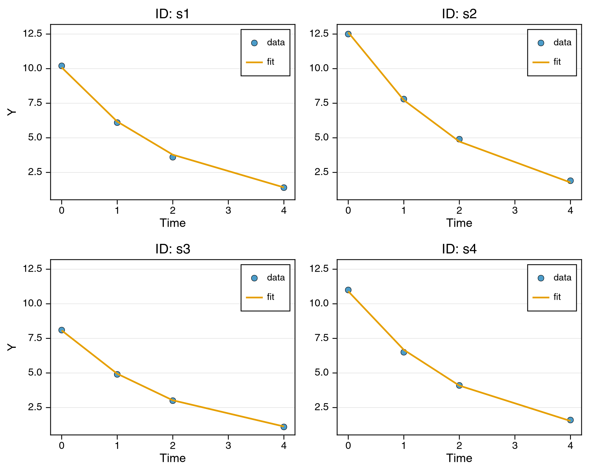

```@raw html
---
layout: home

hero:
  name: "NoLimits.jl"
  text: "Nonlinear mixed-effects modeling for longitudinal data"
  tagline: Mechanistic ODEs, Markov models, differentiable machine learning components, and frequentist and Bayesian estimation - composed in one framework, fit through one interface.
  image:
    src: /logo.png
    alt: NoLimits.jl
  actions:
    - theme: brand
      text: Get Started
      link: /quickstart
    - theme: alt
      text: Tutorials
      link: /tutorials/
    - theme: alt
      text: View on GitHub
      link: https://github.com/manuhuth/NoLimits.jl

features:
  - icon: 🧬
    title: Diverse structural models
    details: Classical nonlinear functions, mechanistic ODE systems, and Markov outcome models combine within a single specification.
    link: /model-building/
    linkText: Model building
  - icon: 🎯
    title: Flexible estimation
    details: Fit one model with Laplace, FOCEI, MCEM, SAEM, or full Bayesian MCMC (plus variational inference for fixed-effects-only models), and compare paradigms without rewriting it.
    link: /estimation/
    linkText: Which method should I use?
  - icon: 🤖
    title: Machine-learning integration
    details: Embed neural networks (including neural-ODE constructions) and soft decision trees alongside known mechanistic terms.
    link: /model-building/universal-function-approximators
    linkText: Neural nets and soft trees
  - icon: 📈
    title: Rich hierarchical variability
    details: Heavy-tailed, skewed, and normalizing-flow random-effect distributions, optionally parameterized by covariates and learned functions.
    link: /model-building/random-effects
    linkText: Random effects
---
```

**NoLimits** stands for **NO**n **LI**near **MI**xed effec**TS**.

## A complete model, fitted, in one screen

```julia
using NoLimits, CairoMakie

model = @Model begin
    @fixedEffects begin
        A0    = RealNumber(10.0, scale=:log)   # population baseline
        k     = RealNumber(0.5,  scale=:log)   # population decay rate
        omega = RealNumber(0.3,  scale=:log)   # between-subject SD
        sigma = RealNumber(0.5,  scale=:log)   # residual SD
    end

    @covariates begin
        time = Covariate()
    end

    @randomEffects begin
        eta = RandomEffect(Normal(0.0, omega); column=:ID)
    end

    @formulas begin
        pred = A0 * exp(eta) * exp(-k * time)
        y ~ Normal(pred, sigma)
    end
end

# df holds one row per (subject, time): columns ID, time, y
dm  = DataModel(model, df; primary_id=:ID, time_col=:time)
res = fit_model(dm, NoLimits.Laplace())
plot_fits(res; ncols=2)
```



Swapping `NoLimits.Laplace()` for `NoLimits.SAEM()`, `NoLimits.MCEM()`, or `NoLimits.MCMC()`
refits the same model with a different estimator, and nothing else changes. The full walkthrough
is in the [Quickstart](quickstart.md).

## Why NoLimits.jl?

Longitudinal studies - where repeated measurements are collected from multiple individuals
over time - are ubiquitous in the biomedical and natural sciences. Analyzing such data
requires models that capture both the underlying process dynamics and the variability across
individuals. Nonlinear mixed-effects models provide a principled statistical framework for
this, but existing software often forces users to choose between model expressiveness,
estimation flexibility, and modern machine-learning integration.

NoLimits.jl is designed to avoid these trade-offs: structural models, estimators, random-effect
distributions, and learned components are independent choices that compose freely, and multiple
outcomes, multiple grouping levels, and covariates at different temporal resolutions can coexist
in one model definition. [Capabilities](capabilities.md) lists what is supported, feature by
feature. The package is built for mixed-effects models but works equally well for
fixed-effects-only analysis.

## Getting Started

New users should begin with the [Installation](installation.md) page and the
[Quickstart](quickstart.md), then work through the
[Tutorials](tutorials/index.md) for hands-on examples covering fixed-effects models,
mixed-effects estimation with multiple methods, ODE-based models, and machine-learning-augmented
dynamics. If you already write population models in NONMEM, Monolix, or nlmixr2, start from
[Coming from NONMEM / Monolix / nlmixr2](coming-from-nonmem.md) instead. When a fit misbehaves,
[Troubleshooting](troubleshooting.md) lists the usual causes.

For a concise overview of what the package can do, see [Capabilities](capabilities.md). For
the mathematical foundations, see [NLME Methodology](nlme-methodology.md).

## R and Python Interfaces

NoLimits is fully usable from R and Python through two thin wrapper packages,
[NoLimitsR](https://github.com/manuhuth/NoLimitsR) and
[NoLimitsPy](https://github.com/manuhuth/NoLimitsPy). Both expose every exported
NoLimits.jl name dynamically, so no per-function glue code exists and new features become
available as soon as the Julia package is updated. Models are written as strings, native
data frames go straight into `DataModel`, and results come back as R `data.frame`s or
pandas `DataFrame`s.

See [Using NoLimits from R and Python](tutorials/r-and-python.md) for installation, the
quickstart in both languages, and how Julia concepts such as Symbols and NamedTuples map
onto native R and Python ones.

## Federated Learning (experimental)

NoLimits exposes the per-site objective and gradient primitives for federated estimation, where several sites fit one shared model without pooling their data. [NoLimitsFlowerDemo](https://github.com/manuhuth/NoLimitsFlowerDemo) is a public showcase that runs this over [Flower](https://flower.ai), matches the equivalent pooled fit, and adds optional secure aggregation and differential privacy. It is under active development and not yet a released package, so its interfaces may change.

## How to Cite

If you use NoLimits.jl in your research, please cite the paper:

```bibtex
@misc{huth2026nolimits,
  title         = {{NoLimits.jl}: Flexible and Composable Nonlinear Mixed-Effects Modeling in Julia},
  author        = {Huth, Manuel and Arruda, Jonas and Schmid, Nina and Gusinow, Roy and Wieland, Vincent and Peiter, Clemens and Hasenauer, Jan},
  year          = {2026},
  eprint        = {2606.24427},
  archivePrefix = {arXiv},
  primaryClass  = {stat.CO},
  url           = {https://arxiv.org/abs/2606.24427}
}
```
