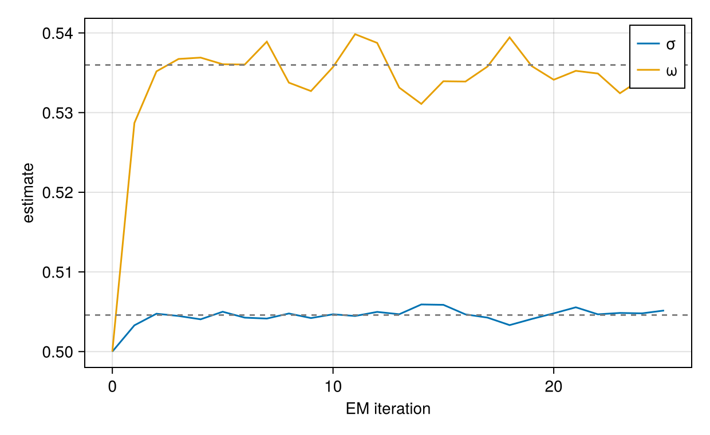
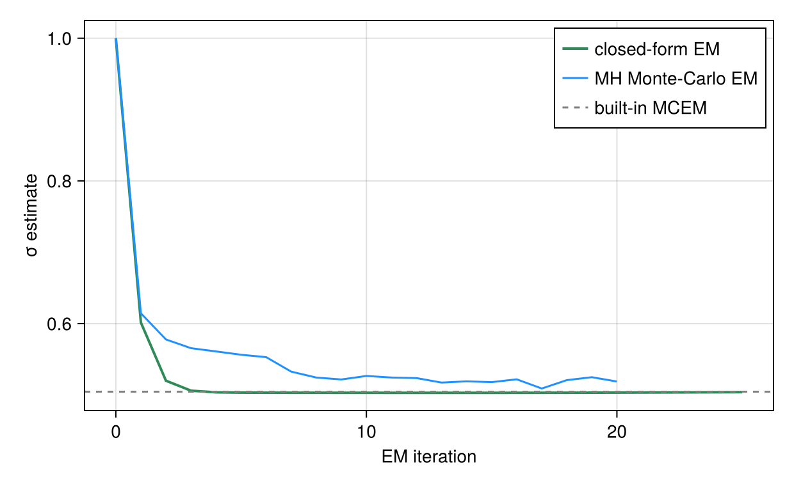

# Building Custom Estimators

NoLimits.jl exposes the statistical building blocks of its fitters - the complete-data
likelihood, the random-effect posterior, and the fitting drivers - as public, semver-stable
functions, so a new estimator can be assembled without touching package internals. Part 1 builds
a complete, `fit_model`-ready estimator in a few lines on the `FitContext` convenience layer.
The rest of the tutorial opens that box on the fine-grained, cache-explicit primitives: a
Monte-Carlo EM that draws the random effects with `sample_random_effect_draws`, a
closed-form-posterior EM for a linear-Gaussian neural-network model built on
`posterior_moments`, a head-to-head comparison of the two, and the full embedding contract.
The fine-grained loops start from deliberately wrong parameters so the convergence is real, and
every estimator is checked against a built-in fitter. See the
[Method-Developer API](../method-developer-api.md) page for the primitive reference and the two
contracts (natural-scale parameters, batches as the random-effect currency).

## What You Will Learn

- How `build_fit_context` and `optimize_parameters` give a complete custom estimator in a few
  lines, with caches, transforms, and result packaging handled for you.
- How to walk the random-effect batch structure with `build_re_batch_infos` and score the
  complete-data density with `joint_loglikelihood` - the cache-explicit layer underneath.
- How to run a Monte-Carlo E-step by drawing the random effects from their exact conditional
  posterior with `sample_random_effect_draws` (Metropolis-Hastings), and a numeric M-step with
  Optimization.jl.
- How the exact Gaussian posterior from `posterior_moments` gives a sampling-free E-step, and how
  the two EMs compare on the same model.
- How to embed a custom estimator in `fit_model` with `build_fit_result` and `uq_family` so it
  plots, transforms, and reports uncertainty like a built-in fitter.

## Part 1: A Complete Estimator in a Few Lines

The quickest way to a working estimator is the `FitContext` convenience layer. We define a
random-intercept model, simulate data from it, and implement a closed-form-posterior EM (the
algorithm is derived in Part 3) as a `FittingMethod` that `fit_model` can drive.

```julia
using NoLimits
using Optimization, OptimizationOptimJL, LineSearches
using ComponentArrays, Distributions, DataFrames, Random, LinearAlgebra
using Turing: MH
using CairoMakie

model = @Model begin
    @fixedEffects begin
        a = RealNumber(1.0)
        σ = RealNumber(0.5, scale=:log)
        ω = RealNumber(0.5, scale=:log)
    end
    @covariates begin
        t = Covariate()
    end
    @randomEffects begin
        b = RandomEffect(Normal(0.0, ω); column=:ID)
    end
    @formulas begin
        y ~ Normal(a + b, σ)
    end
end

n_id, n_obs = 30, 6
df = DataFrame(
    ID=repeat(1:n_id; inner=n_obs),
    t=repeat(collect(range(0.0, 1.0; length=n_obs)), n_id),
    y=zeros(n_id * n_obs),
)
dm = simulate_data_model(DataModel(model, df; primary_id=:ID, time_col=:t);
    rng=MersenneTwister(42))
```

The whole estimator is one struct and one `fit_method`:

```julia
struct MyEM <: FittingMethod
    n_iter::Int
end
MyEM(; n_iter=25) = MyEM(n_iter)
NoLimits.uq_family(::MyEM) = :wald_re      # inherit random-effect Wald intervals

function NoLimits.fit_method(dm, m::MyEM, args...; theta_0_untransformed=nothing, kwargs...)
    ctx = build_fit_context(dm)
    θ = something(theta_0_untransformed, initial_parameters(ctx))
    for _ in 1:m.n_iter
        pm = posterior_moments(ctx, θ)                # E-step: exact posterior N(b*, Σ)
        θ, _ = optimize_parameters(ctx; θ_start=θ) do θn      # M-step, natural scale
            -sum(joint_loglikelihood(ctx, bi, θn, pm[bi][1]) +
                 0.5 * tr(pm[bi][2] * joint_loglikelihood_hessian(ctx, bi, θn, pm[bi][1]))
                 for bi in eachindex(get_batch_infos(ctx)))
        end
    end
    return build_fit_result(ctx, m, θ; kind=:frequentist_re,
        objective=-laplace_marginal(ctx, θ), iterations=m.n_iter)
end

res_quick = fit_model(dm, MyEM())
NoLimits.summarize(res_quick)
```

```text
FitResultSummary
════════════════════════════════════════════════════════════════════════════════════════════════
Overview
  method                              : myem
  inference                           : frequentist
  scale                               : natural
  objective                           : 163.0051
  iterations                          : 25
  parameters shown (reported / total) : 3 / 3

Parameter estimates
  parameter      Estimate
  -----------------------
  a                1.0718
  σ                0.5046
  ω                0.5351

Outcome data coverage
  outcome       n_obs   n_missing
  -------------------------------
  y               180           0
  TOTAL           180           0

Empirical Bayes random effects summary (across RE levels)
  random effect       n          mean            sd           q25        median           q75
  ---------------------------------------------------------------------------
  b                  30        0.0020        0.4993       -0.3610       -0.0145        0.3493
```

What each piece does:

- **`build_fit_context(dm)`** performs, once, the setup every fitting loop needs: it groups the
  individuals into independent random-effect *batches* (individuals sharing a random-effect
  level always land in the same batch), caches the levels fixed through `constants_re`, and
  builds the likelihood evaluation cache (solver configuration, templates, buffers) that the
  density primitives reuse instead of rebuilding state on every call. The context is
  θ-independent - build it once per fit and reuse it across all iterations; parameters flow
  through every call. With a context in hand, the primitives lose their cache arguments and
  address batches by index: `joint_loglikelihood(ctx, bi, θ, b)`, `posterior_moments(ctx, θ)`,
  `laplace_marginal(ctx, θ)`, and so on.
- **`posterior_moments(ctx, θ)`** is the E-step: the exact Gaussian posterior `N(b*, Σ)` of each
  batch's random effects (exact because this model is linear in `b`; Part 3 treats the general
  case).
- **`optimize_parameters(ctx) do θn ... end`** is the M-step: the objective is written purely in
  natural-scale parameters, and the transformed-scale round trip (log/logit transforms,
  `ComponentArray` reassembly, PSD symmetrisation, the back-transform of the optimum) is handled
  internally - `σ` and `ω` stay positive without any code in the objective.
- **`build_fit_result(ctx, …)`** packages `θ` into the same `FitResult` the built-in fitters
  return - `eb_modes` is filled automatically for random-effect kinds - so `get_params`,
  `get_random_effects`, `plot_fits`, and `compute_uq` all work on `res_quick` (Part 5 shows
  them and explains each argument).
- `theta_0_untransformed` is the one contract to honour: `Multistart` and `pooled_init` deliver
  their starting points through it.

Every context call forwards to a cache-explicit primitive with the context's stored objects -
nothing is hidden, and the explicit layer remains available for full control. The rest of the
tutorial works on that layer.

## Part 2: Monte-Carlo EM on the Explicit Primitives

Monte-Carlo EM alternates an E-step - drawing the random effects `b` from their posterior at the
current `θ` - with an M-step that maximises the expected complete-data log-likelihood.
`sample_random_effect_draws` supplies the draws and `joint_loglikelihood` is the per-draw density.
Because the joint already carries the random-effect prior, one M-step over all parameters updates
the fixed effects and the random-effect variance together. This time the caches, transforms, and
batch structure are threaded by hand - full control over every evaluation. See
[MCEM](../estimation/mcem.md) for the production fitter.

The data (from Part 1) are simulated from `a = 1`, `σ = ω = 0.5`. To make the fit a real test
rather than a no-op, the optimiser is started away from those values, so the EM path has
somewhere to travel.

```julia
θ0 = get_θ0_untransformed(get_fixed(get_model(dm)))
θ_start = copy(θ0)
θ_start.a = 0.0
θ_start.σ = 1.0
θ_start.ω = 1.0
```

### The EM Loop

Each E-step draws the random effects from their exact conditional posterior `p(b | y, θ)` with a
Metropolis-Hastings sampler. Because MH returns unweighted draws from that posterior, the
Q-function is a plain average over them - no importance weights, which would only be needed if the
draws came from a different proposal. The draws are held fixed while `θ` is optimised.

```julia
function mcem_from_scratch(dm; θ_start, n_iter=20, n_samples=100, rng=MersenneTwister(0))
    fe = get_fixed(get_model(dm))
    inv_transform = get_inverse_transform(fe)
    θ = copy(θ_start)
    θt0 = get_transform(fe)(θ)

    _, batches, cc = build_re_batch_infos(dm, NamedTuple())
    cache = build_likelihood_cache(dm; force_saveat=true)
    history = [NamedTuple(θ)]

    for _ in 1:n_iter
        # E-step: Metropolis-Hastings draws from the exact conditional posterior p(b | y, θ).
        samples = sample_random_effect_draws(dm, θ; method=:mcmc, sampler=MH(),
            n_samples=n_samples, rng=rng)
        draws = [get_draws(s) for s in samples]

        # Q(θ) = Σ_batch mean_draw joint_loglikelihood. The joint carries the RE prior,
        # so a, σ and ω are all updated in this one M-step.
        function negQ(θt_vec, _)
            θn = symmetrize_psd_parameters(dm,
                inv_transform(ComponentArray(θt_vec, getaxes(θt0))))
            acc = zero(eltype(θt_vec))
            for bi in eachindex(batches)
                D = draws[bi]
                n_draw = size(D, 2)
                for m in axes(D, 2)
                    acc += joint_loglikelihood(dm, batches[bi], θn, view(D, :, m);
                        const_cache=cc, cache=cache) / n_draw
                end
            end
            return -acc
        end

        prob = OptimizationProblem(OptimizationFunction(negQ, AutoForwardDiff()),
            collect(get_transform(fe)(θ)))
        sol = solve(prob, LBFGS(linesearch=BackTracking()); iterations=50)
        θ = inv_transform(ComponentArray(sol.u, getaxes(θt0)))
        push!(history, NamedTuple(θ))
    end
    return θ, history
end

θ_mcem, hist_mcem = mcem_from_scratch(dm; θ_start=θ_start)
NamedTuple(θ_mcem)
```

```text
(a = 1.0292461861307223, σ = 0.5188422506428074, ω = 0.5323302070226873)
```

### Check Against the Built-in Fitter

```julia
res_mcem = fit_model(dm, MCEM(; maxiters=25);
    serialization=EnsembleSerial(), rng=MersenneTwister(1))
get_params(res_mcem; scale=:untransformed)
```

```text
ComponentVector{Float64}(a = 1.0714777759110046, σ = 0.50458546245996, ω = 0.5359827297425421)
```

### Convergence

```julia
ref = get_params(res_mcem; scale=:untransformed)
fig1 = Figure(size=(620, 380))
ax = CairoMakie.Axis(fig1[1, 1]; xlabel="EM iteration", ylabel="estimate")
its = 0:(length(hist_mcem) - 1)
lines!(ax, its, [h.σ for h in hist_mcem]; label="σ")
lines!(ax, its, [h.ω for h in hist_mcem]; label="ω")
hlines!(ax, [ref.σ, ref.ω]; color=:gray, linestyle=:dash)
axislegend(ax)
fig1
```



## Part 3: Closed-Form-Posterior EM

When the model is linear in the random effect with Gaussian noise, `y = b + f(x) + e`, the
random-effect posterior is exactly Gaussian, so the E-step needs no sampling: `posterior_moments`
returns the exact posterior mean (the mode) and covariance `Σ = (−H)⁻¹`. Here `f` is a neural
network of a covariate. The joint is quadratic in `b`, so its expectation under the posterior is
also closed-form - the mode value plus a trace correction - giving a fully deterministic EM. See
[Laplace](../estimation/laplace.md), which is exact for this model class.

### Model and Data

```julia
using Lux, LinearAlgebra

chain = Chain(Dense(1, 6, tanh), Dense(6, 1))
nn_model = @Model begin
    @fixedEffects begin
        ζ = NNParameters(chain; function_name=:NN1, calculate_se=false)
        σ = RealNumber(0.4, scale=:log)
        ω = RealNumber(0.5, scale=:log)
    end
    @covariates begin
        t = Covariate()
        x = Covariate()
    end
    @randomEffects begin
        b = RandomEffect(Normal(0.0, ω); column=:ID)
    end
    @formulas begin
        y ~ Normal(b + NN1([x], ζ)[1], σ)
    end
end

rng = MersenneTwister(1)
m_id, m_obs = 25, 8
df_nn = DataFrame(
    ID=repeat(1:m_id; inner=m_obs),
    t=repeat(collect(range(0.0, 1.0; length=m_obs)), m_id),
    x=randn(rng, m_id * m_obs),
    y=zeros(m_id * m_obs),
)
dm_nn = simulate_data_model(DataModel(nn_model, df_nn; primary_id=:ID, time_col=:t);
    rng=MersenneTwister(7))
```

As in Part 2, the data-generating parameters are captured (their `ζ` traces the true effect curve
below) and the fit is started off them.

```julia
θ0_nn = get_θ0_untransformed(get_fixed(get_model(dm_nn)))
θ_start_nn = copy(θ0_nn)
θ_start_nn.σ = 1.0
θ_start_nn.ω = 1.0
```

### The Closed-Form EM Loop

The expected complete-data log-likelihood of a quadratic joint under a Gaussian posterior is
`Q(θ) = joint(θ, m) + ½·tr(Σ · ∇²_b joint(θ, m))`; the trace term accounts exactly for the
posterior spread of `b`. `joint_loglikelihood_hessian` supplies `∇²_b joint`, and both moments
come from `posterior_moments` at the previous `θ`. The same off-truth `θ_start` is threaded in.

```julia
function closed_form_em(dm; θ_start=get_θ0_untransformed(get_fixed(get_model(dm))), n_iter=30)
    fe = get_fixed(get_model(dm))
    inv_transform = get_inverse_transform(fe)
    θ = copy(θ_start)
    θt0 = get_transform(fe)(θ)

    _, batches, cc = build_re_batch_infos(dm, NamedTuple())
    cache = build_likelihood_cache(dm; force_saveat=true)
    history = [(σ=NamedTuple(θ).σ, ω=NamedTuple(θ).ω)]

    for _ in 1:n_iter
        # E-step: exact Gaussian posterior per batch (mode = mean, Σ = (−H)⁻¹). No sampling.
        pm = posterior_moments(dm, θ)

        # M-step: exact expected complete-data log-likelihood for a quadratic joint,
        # Q(θ) = Σ_batch [ joint(θ, m) + ½·tr(Σ · ∇²_b joint(θ, m)) ].
        function negQ(θt_vec, _)
            θn = symmetrize_psd_parameters(dm,
                inv_transform(ComponentArray(θt_vec, getaxes(θt0))))
            acc = zero(eltype(θt_vec))
            for bi in eachindex(batches)
                m, Σ = pm[bi]
                Σ === nothing && continue
                jl = joint_loglikelihood(dm, batches[bi], θn, m; const_cache=cc, cache=cache)
                H = joint_loglikelihood_hessian(dm, batches[bi], θn, m;
                    const_cache=cc, cache=cache)
                acc += jl + 0.5 * tr(Σ * H)
            end
            return -acc
        end

        prob = OptimizationProblem(OptimizationFunction(negQ, AutoForwardDiff()),
            collect(get_transform(fe)(θ)))
        sol = solve(prob, LBFGS(linesearch=BackTracking()); iterations=50)
        θ = inv_transform(ComponentArray(sol.u, getaxes(θt0)))
        push!(history, (σ=NamedTuple(θ).σ, ω=NamedTuple(θ).ω))
    end
    return θ, history
end

θ_cf, hist_cf = closed_form_em(dm_nn; θ_start=θ_start_nn)
(σ=NamedTuple(θ_cf).σ, ω=NamedTuple(θ_cf).ω)
```

```text
(σ = 0.3829952239980635, ω = 0.5022677891478675)
```

### Check Against Laplace

Laplace is exact for a linear-Gaussian model, so its estimates are the reference. `Laplace` is
qualified because `Distributions` also exports that name.

```julia
res_lap = fit_model(dm_nn, NoLimits.Laplace(); serialization=EnsembleSerial())
p = get_params(res_lap; scale=:untransformed)
(σ=p.σ, ω=p.ω)
```

```text
(σ = 0.39119644390127634, ω = 0.5052622384835134)
```

### The Recovered Effect Function

The estimator's job is to recover the concentration-effect function `f(x)`, so the informative
plot is against the covariate `x`: the fitted `NN1(x; ζ̂)` against the data-generating
`NN1(x; ζ_true)`, over the observed data. `get_model_funs` returns the callable `NN1`, and
`get_df` returns the simulated data.

```julia
funs = get_model_funs(nn_model)
sim_nn = get_df(dm_nn)
xs = collect(range(minimum(sim_nn.x), maximum(sim_nn.x); length=200))
fitted = [funs.NN1([xi], θ_cf.ζ)[1] for xi in xs]
truef = [funs.NN1([xi], θ0_nn.ζ)[1] for xi in xs]

fig2 = Figure(size=(620, 380))
ax2 = CairoMakie.Axis(fig2[1, 1]; xlabel="x", ylabel="y")
scatter!(ax2, sim_nn.x, sim_nn.y; color=(:gray, 0.5), markersize=6, label="data")
lines!(ax2, xs, truef; color=:black, linestyle=:dash, label="true f(x)")
lines!(ax2, xs, fitted; color=:dodgerblue, linewidth=2, label="fitted f(x)")
axislegend(ax2; position=:rb)
fig2
```


## Part 4: Closed-Form EM vs Monte-Carlo EM

The Part 1 linear model is also linear in its random effect with Gaussian noise, so
`closed_form_em` applies to `dm` directly. Both estimators target the same Q-function: the
Monte-Carlo EM approximates it by sampling the posterior (a noisy path), while the closed-form EM
evaluates it exactly (a smooth, deterministic path). Run from the same off-truth start, they land
on the same estimate, which the built-in MCEM confirms.

```julia
θ_cf_lin, hist_cf_lin = closed_form_em(dm; θ_start=θ_start, n_iter=25)
(mh_mcem=NamedTuple(θ_mcem), closed_form=NamedTuple(θ_cf_lin),
    builtin_mcem=get_params(res_mcem; scale=:untransformed))
```

```text
(mh_mcem = (a = 1.0292461861307223, σ = 0.5188422506428074, ω = 0.5323302070226873), closed_form = (a = 0.9131841937538951, σ = 0.5039160288038839, ω = 0.5672973299638003), builtin_mcem = (a = 1.0714777759110046, σ = 0.50458546245996, ω = 0.5359827297425421))
```

```julia
fig3 = Figure(size=(620, 380))
ax3 = CairoMakie.Axis(fig3[1, 1]; xlabel="EM iteration", ylabel="σ estimate")
lines!(ax3, 0:(length(hist_cf_lin) - 1), [h.σ for h in hist_cf_lin];
    color=:seagreen, linewidth=2, label="closed-form EM")
lines!(ax3, 0:(length(hist_mcem) - 1), [h.σ for h in hist_mcem];
    color=:dodgerblue, label="MH Monte-Carlo EM")
hlines!(ax3, [ref.σ]; color=:gray, linestyle=:dash, label="built-in MCEM")
axislegend(ax3)
fig3
```



## Part 5: Embedding, Fine-Grained

The explicit loops above return a bare `θ`. Wrapping one as a `FittingMethod` makes it
first-class, exactly as `MyEM` was in Part 1 - but here every argument is spelled out, on the
explicit primitives. `build_fit_result` packages the fit in a single call, and the `uq_family`
trait opts the method into Wald intervals while keeping its own type. We reuse `closed_form_em`
from Part 3 and apply it to the linear model `dm` from Part 1.

```julia
struct ClosedFormEM <: FittingMethod
    n_iter::Int
end
ClosedFormEM(; n_iter=30) = ClosedFormEM(n_iter)

# keep our own method type but inherit random-effect Wald UQ
NoLimits.uq_family(::ClosedFormEM) = :wald_re
```

Only three arguments to `build_fit_result` carry meaning, so the smallest working `fit_method`
is short:

```julia
function NoLimits.fit_method(dm, m::ClosedFormEM, args...; kwargs...)
    θ, _ = closed_form_em(dm; n_iter=m.n_iter)
    return build_fit_result(dm, m, θ;
        kind=:frequentist_re,                # result routing: a frequentist result with REs
        objective=-laplace_marginal(dm, θ),  # value reported by get_objective / summaries
        eb_modes=empirical_bayes(dm, θ))     # random-effect modes the accessors resolve
end
```

Why each of the three is needed:

- `kind` is the routing tag. `build_fit_result` produces a `StandardOptimizationResult{kind}`,
  and `get_random_effects`, `get_loglikelihood`, and `plot_fits` dispatch on it. `:frequentist_re`
  makes a `FrequentistREResult` - a frequentist result that carries random effects - whose
  accessors read them from `eb_modes`; the default `:frequentist` has no random-effect branch, so
  `get_random_effects` would error.
- `objective` is the number `get_objective` returns and the summaries display. The EM maximises
  the marginal likelihood, so we report its negative, `-laplace_marginal(dm, θ)` - the marginal
  log-likelihood with the random effects integrated out (a Laplace approximation, exact for this
  linear-Gaussian model). Reporting it this way puts the objective on the same scale as
  `fit_model(dm, Laplace())`. It plays no part in the fitting itself, only in reporting.
- `eb_modes` are the per-batch random-effect modes from `empirical_bayes`; together with
  `kind=:frequentist_re` they are what the accessors and plots resolve the random effects from.

A production method also forwards the options `fit_model` passes through - `store_data_model`
(whether to keep `dm` in the result, so `plot_fits(res)`/`compute_uq(res)` work without re-passing
it), `constants_re` (fixed random-effect levels), and `theta_0_untransformed` (the starting point;
`Multistart` and `pooled_init` deliver their starts through it, so a method that ignores it would
run every multistart from the same point) - and records the iteration count. That is the form used
below:

```julia
function NoLimits.fit_method(dm, m::ClosedFormEM, args...;
        constants_re=NamedTuple(), store_data_model=true,
        theta_0_untransformed=nothing, kwargs...)
    θ0 = theta_0_untransformed === nothing ?
         get_θ0_untransformed(get_fixed(get_model(dm))) : theta_0_untransformed
    θ, _ = closed_form_em(dm; θ_start=θ0, n_iter=m.n_iter)
    return build_fit_result(dm, m, θ;
        kind=:frequentist_re,
        objective=-laplace_marginal(dm, θ),
        iterations=m.n_iter,
        eb_modes=empirical_bayes(dm, θ; constants_re=constants_re),
        store_data_model=store_data_model, fit_args=args)
end
```

The custom estimator now behaves like a built-in method - `get_params`, `get_random_effects`,
`get_loglikelihood`, and the summary all work, and the reported method keeps its own name.

```julia
res = fit_model(dm, ClosedFormEM())
NoLimits.summarize(res)
```

```text
FitResultSummary
════════════════════════════════════════════════════════════════════════════════════════════════
Overview
  method                              : closedformem
  inference                           : frequentist
  scale                               : natural
  objective                           : 163.0049
  iterations                          : 30
  parameters shown (reported / total) : 3 / 3

Parameter estimates
  parameter      Estimate
  -----------------------
  a                1.0729
  σ                0.5046
  ω                0.5351

Outcome data coverage
  outcome       n_obs   n_missing
  -------------------------------
  y               180           0
  TOTAL           180           0

Empirical Bayes random effects summary (across RE levels)
  random effect       n          mean            sd           q25        median           q75
  ---------------------------------------------------------------------------
  b                  30        0.0010        0.4993       -0.3620       -0.0156        0.3483
```

Wald intervals come straight from `compute_uq`; the `uq_family` trait routes it to the
random-effects Laplace covariance evaluated at the estimate.

```julia
uq = compute_uq(res; method=:wald, pseudo_inverse=true)
NoLimits.summarize(res, uq)
```

```text
UQResultSummary
════════════════════════════════════════════════════════════════════════════════════════════════
Overview
  backend                             : wald
  source_method                       : closedformem
  inference                           : frequentist
  scale                               : natural
  objective                           : 163.0049
  interval level                      : 0.9500
  parameters shown (reported / total) : 3 / 3

Parameter uncertainty summary
  parameter      Estimate    Std. Error      CI Lower      CI Upper
  ---------------------------------------------------
  a                1.0729        0.1049        0.8687        1.2759
  σ                0.5046        0.0293        0.4523        0.5647
  ω                0.5351        0.0800        0.3979        0.7153

Outcome data coverage
  outcome       n_obs   n_missing
  -------------------------------
  y               180           0
  TOTAL           180           0

Empirical Bayes random effects summary (across RE levels)
  random effect       n          mean            sd           q25        median           q75
  ---------------------------------------------------------------------------
  b                  30        0.0010        0.4993       -0.3620       -0.0156        0.3483
```

Predictions plot exactly as for a built-in fit.

```julia
p_embed = plot_fits(res; observable=:y, individuals_idx=[1, 2], ncols=2)
p_embed
```


## Summary

- `build_fit_context` + `optimize_parameters` are the quick path: caches, transforms, and result
  packaging handled in a handful of lines, with every context call forwarding to a cache-explicit
  primitive.
- `build_re_batch_infos` and `joint_loglikelihood` express the complete-data likelihood directly,
  so a bespoke fitting loop needs no access to package internals.
- `sample_random_effect_draws` gives a Monte-Carlo E-step for any model by drawing the random
  effects from their exact conditional posterior; `posterior_moments` gives an exact,
  sampling-free E-step whenever that posterior is Gaussian. On a shared linear-Gaussian model the
  two agree, the closed-form path being deterministic and the Monte-Carlo one noisy.
- Both hand-written EMs recover the built-in estimates from a deliberately wrong start, and their
  parameters are ordinary natural-scale `ComponentArray`s.
- `build_fit_result` turns an estimate into the same `FitResult` the built-in fitters return, so
  a custom method inherits every accessor, plot, and transform; `kind=:frequentist_re` selects the
  frequentist-with-random-effects result, and the `uq_family` trait adds Wald uncertainty while
  the method keeps its own type.
