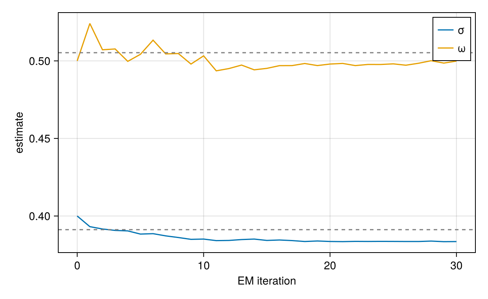

# Building Custom Estimators

NoLimits.jl exposes the statistical building blocks of its fitters - the complete-data
likelihood, the random-effect posterior, and the fitting drivers - as public, semver-stable
functions, so a new estimator can be assembled without touching package internals. This
tutorial builds two estimators from scratch on those primitives: a general Monte-Carlo EM that
draws random effects with `sample_eta`, and a closed-form-posterior EM for a linear-Gaussian
neural-network model whose exact posterior is available through `posterior_moments`. Each is
checked against a built-in fitter. See the [Method-Developer API](../method-developer-api.md)
page for the primitive reference and the two contracts (natural-scale parameters, batches as the
random-effect currency).

## What You Will Learn

- How to walk the random-effect batch structure with `build_re_batch_infos` and score the
  complete-data density with `joint_loglikelihood`.
- How to run a Monte-Carlo E-step with `sample_eta` and a numeric M-step with Optimization.jl.
- How the exact Gaussian posterior from `posterior_moments` gives a sampling-free E-step.
- How to check a hand-written estimator against a built-in method.
- How to embed a custom estimator in `fit_model` with `build_fit_result` and `uq_family` so it
  plots, transforms, and reports uncertainty like a built-in fitter.

## Part 1: Monte-Carlo EM

Monte-Carlo EM alternates an E-step - drawing `η` from its posterior at the current `θ` - with
an M-step that maximises the expected complete-data log-likelihood. `sample_eta` supplies the
draws and `joint_loglikelihood` is the per-draw density; because the joint already carries the
random-effect prior, one M-step over all parameters updates the fixed effects and the
random-effect variance together. See [MCEM](../estimation/mcem.md) for the production fitter.

### Model and Data

```julia
using NoLimits
using Optimization, OptimizationOptimJL, LineSearches
using ComponentArrays, Distributions, DataFrames, Random
using CairoMakie

model = @Model begin
    @fixedEffects begin
        a = RealNumber(1.0)
        σ = RealNumber(0.5, scale=:log)
        ω = RealNumber(0.5, scale=:log)
    end
    @covariates begin
        t = Covariate()
    end
    @randomEffects begin
        η = RandomEffect(Normal(0.0, ω); column=:ID)
    end
    @formulas begin
        y ~ Normal(a + η, σ)
    end
end

n_id, n_obs = 30, 6
df = DataFrame(
    ID=repeat(1:n_id; inner=n_obs),
    t=repeat(collect(range(0.0, 1.0; length=n_obs)), n_id),
    y=zeros(n_id * n_obs),
)
dm = simulate_data_model(DataModel(model, df; primary_id=:ID, time_col=:t);
    rng=MersenneTwister(42))
```

### The EM Loop

The random-effect draws are taken once per iteration and held fixed while `θ` is optimised - the
mode-finding inside `sample_eta` is not differentiable in `θ`, so it must sit outside the M-step
objective. Importance weights are self-normalised with a `softmax`.

```julia
function mcem_from_scratch(dm; n_iter=25, n_samples=300, rng=MersenneTwister(0))
    fe = get_fixed(get_model(dm))
    inv_transform = get_inverse_transform(fe)
    θ = get_θ0_untransformed(fe)
    θt0 = get_transform(fe)(θ)

    _, batches, cc = build_re_batch_infos(dm, NamedTuple())
    cache = build_likelihood_cache(dm; force_saveat=true)
    history = [NamedTuple(θ)]

    for _ in 1:n_iter
        # E-step: one importance sample per batch, drawn once and held fixed.
        samples = sample_eta(dm, θ; method=:importance, n_samples=n_samples, rng=rng)
        draws = [get_draws(s) for s in samples]
        weights = map(samples) do s
            w = exp.(get_log_weights(s) .- maximum(get_log_weights(s)))
            w ./ sum(w)
        end

        # Q(θ) = Σ_batch Σ_draw w · joint_loglikelihood. The joint carries the RE
        # prior, so a, σ and ω are all updated in this one M-step.
        function negQ(θt_vec, _)
            θn = symmetrize_psd_parameters(dm,
                inv_transform(ComponentArray(θt_vec, getaxes(θt0))))
            acc = zero(eltype(θt_vec))
            for bi in eachindex(batches)
                D, w = draws[bi], weights[bi]
                for m in axes(D, 2)
                    acc += w[m] * joint_loglikelihood(dm, batches[bi], θn, view(D, :, m);
                        const_cache=cc, cache=cache)
                end
            end
            return -acc
        end

        prob = OptimizationProblem(OptimizationFunction(negQ, AutoForwardDiff()),
            collect(get_transform(fe)(θ)))
        sol = solve(prob, LBFGS(linesearch=BackTracking()); iterations=50)
        θ = inv_transform(ComponentArray(sol.u, getaxes(θt0)))
        push!(history, NamedTuple(θ))
    end
    return θ, history
end

θ_mcem, hist_mcem = mcem_from_scratch(dm)
NamedTuple(θ_mcem)
```

```text
(a = 1.0781994511103565, σ = 0.5051571731472654, ω = 0.5359268668902755)
```

### Check Against the Built-in Fitter

```julia
res_mcem = fit_model(dm, MCEM(; maxiters=25);
    serialization=EnsembleSerial(), rng=MersenneTwister(1))
get_params(res_mcem; scale=:untransformed)
```

```text
ComponentVector{Float64}(a = 1.0714777759110046, σ = 0.50458546245996, ω = 0.5359827297425421)
```

### Convergence

```julia
fig1 = Figure(size=(620, 380))
ax = CairoMakie.Axis(fig1[1, 1]; xlabel="EM iteration", ylabel="estimate")
its = 0:(length(hist_mcem) - 1)
lines!(ax, its, [h.σ for h in hist_mcem]; label="σ")
lines!(ax, its, [h.ω for h in hist_mcem]; label="ω")
ref = get_params(res_mcem; scale=:untransformed)
hlines!(ax, [ref.σ, ref.ω]; color=:gray, linestyle=:dash)
axislegend(ax)
fig1
```


## Part 2: Closed-Form-Posterior EM

When the model is linear in the random effect with Gaussian noise, `y = η + f(x) + e`, the
random-effect posterior is exactly Gaussian, so the E-step needs no sampling: `posterior_moments`
returns the exact posterior mean (the mode) and covariance `Σ = (−H)⁻¹`. Here `f` is a neural
network of a covariate. The joint is quadratic in `η`, so its expectation under the posterior is
also closed-form - the mode value plus a trace correction - giving a fully deterministic EM. See
[Laplace](../estimation/laplace.md), which is exact for this model class.

### Model and Data

```julia
using Lux, LinearAlgebra

chain = Chain(Dense(1, 6, tanh), Dense(6, 1))
nn_model = @Model begin
    @fixedEffects begin
        ζ = NNParameters(chain; function_name=:NN1, calculate_se=false)
        σ = RealNumber(0.4, scale=:log)
        ω = RealNumber(0.5, scale=:log)
    end
    @covariates begin
        t = Covariate()
        x = Covariate()
    end
    @randomEffects begin
        η = RandomEffect(Normal(0.0, ω); column=:ID)
    end
    @formulas begin
        y ~ Normal(η + NN1([x], ζ)[1], σ)
    end
end

rng = MersenneTwister(1)
m_id, m_obs = 25, 8
df_nn = DataFrame(
    ID=repeat(1:m_id; inner=m_obs),
    t=repeat(collect(range(0.0, 1.0; length=m_obs)), m_id),
    x=randn(rng, m_id * m_obs),
    y=zeros(m_id * m_obs),
)
dm_nn = simulate_data_model(DataModel(nn_model, df_nn; primary_id=:ID, time_col=:t);
    rng=MersenneTwister(7))
```

### The Closed-Form EM Loop

The expected complete-data log-likelihood of a quadratic joint under a Gaussian posterior is
`Q(θ) = joint(θ, m) + ½·tr(Σ · ∇²_b joint(θ, m))`; the trace term accounts exactly for the
posterior spread of `η`. `joint_loglikelihood_hessian` supplies `∇²_b joint`, and both moments
come from `posterior_moments` at the previous `θ`.

```julia
function closed_form_em(dm; n_iter=30)
    fe = get_fixed(get_model(dm))
    inv_transform = get_inverse_transform(fe)
    θ = get_θ0_untransformed(fe)
    θt0 = get_transform(fe)(θ)

    _, batches, cc = build_re_batch_infos(dm, NamedTuple())
    cache = build_likelihood_cache(dm; force_saveat=true)
    history = [(σ=NamedTuple(θ).σ, ω=NamedTuple(θ).ω)]

    for _ in 1:n_iter
        # E-step: exact Gaussian posterior per batch (mode = mean, Σ = (−H)⁻¹). No sampling.
        pm = posterior_moments(dm, θ)

        # M-step: exact expected complete-data log-likelihood for a quadratic joint,
        # Q(θ) = Σ_batch [ joint(θ, m) + ½·tr(Σ · ∇²_b joint(θ, m)) ].
        function negQ(θt_vec, _)
            θn = symmetrize_psd_parameters(dm,
                inv_transform(ComponentArray(θt_vec, getaxes(θt0))))
            acc = zero(eltype(θt_vec))
            for bi in eachindex(batches)
                m, Σ = pm[bi]
                Σ === nothing && continue
                jl = joint_loglikelihood(dm, batches[bi], θn, m; const_cache=cc, cache=cache)
                H = joint_loglikelihood_hessian(dm, batches[bi], θn, m;
                    const_cache=cc, cache=cache)
                acc += jl + 0.5 * tr(Σ * H)
            end
            return -acc
        end

        prob = OptimizationProblem(OptimizationFunction(negQ, AutoForwardDiff()),
            collect(get_transform(fe)(θ)))
        sol = solve(prob, LBFGS(linesearch=BackTracking()); iterations=50)
        θ = inv_transform(ComponentArray(sol.u, getaxes(θt0)))
        push!(history, (σ=NamedTuple(θ).σ, ω=NamedTuple(θ).ω))
    end
    return θ, history
end

θ_cf, hist_cf = closed_form_em(dm_nn)
(σ=NamedTuple(θ_cf).σ, ω=NamedTuple(θ_cf).ω)
```

```text
(σ = 0.38353881249002136, ω = 0.49985413359255987)
```

### Check Against Laplace

Laplace is exact for a linear-Gaussian model, so its estimates are the reference. `Laplace` is
qualified because `Distributions` also exports that name.

```julia
res_lap = fit_model(dm_nn, NoLimits.Laplace(); serialization=EnsembleSerial())
p = get_params(res_lap; scale=:untransformed)
(σ=p.σ, ω=p.ω)
```

```text
(σ = 0.39119644390127634, ω = 0.5052622384835134)
```

### Convergence

```julia
fig2 = Figure(size=(620, 380))
ax2 = CairoMakie.Axis(fig2[1, 1]; xlabel="EM iteration", ylabel="estimate")
its2 = 0:(length(hist_cf) - 1)
lines!(ax2, its2, [h.σ for h in hist_cf]; label="σ")
lines!(ax2, its2, [h.ω for h in hist_cf]; label="ω")
hlines!(ax2, [p.σ, p.ω]; color=:gray, linestyle=:dash)
axislegend(ax2)
fig2
```



## Part 3: Embedding in `fit_model`

The loops above return a bare `θ`. Wrapping one as a `FittingMethod` makes it first-class:
`fit_model` returns a `FitResult` that transforms, plots, and quantifies uncertainty like any
built-in fitter. `build_fit_result` packages the fit in a single call, and the `uq_family` trait
opts the method into Wald intervals while keeping its own type. We reuse `closed_form_em` from
Part 2 and apply it to the linear model `dm` from Part 1.

```julia
struct ClosedFormEM <: FittingMethod
    n_iter::Int
end
ClosedFormEM(; n_iter=30) = ClosedFormEM(n_iter)

# keep our own method type but inherit random-effect Wald UQ
NoLimits.uq_family(::ClosedFormEM) = :wald_re
```

Only three arguments to `build_fit_result` carry meaning, so the smallest working `fit_method`
is short:

```julia
function NoLimits.fit_method(dm, m::ClosedFormEM, args...; kwargs...)
    θ, _ = closed_form_em(dm; n_iter=m.n_iter)
    return build_fit_result(dm, m, θ;
        kind=:laplace,                       # result routing: makes a LaplaceResult
        objective=-laplace_marginal(dm, θ),  # value reported by get_objective / summaries
        eb_modes=empirical_bayes(dm, θ))     # random-effect modes the accessors resolve
end
```

Why each of the three is needed:

- `kind` is the routing tag. `build_fit_result` produces a `StandardOptimizationResult{kind}`,
  and `get_random_effects`, `get_loglikelihood`, and `plot_fits` dispatch on it. `:laplace`
  makes a `LaplaceResult`, whose accessors read the random effects from `eb_modes`; the default
  `:mle` has no random-effect branch, so `get_random_effects` would error.
- `objective` is the number `get_objective` returns and the summaries display. The EM maximises
  the marginal likelihood, so we report its negative, `-laplace_marginal(dm, θ)` - the marginal
  log-likelihood with the random effects integrated out (a Laplace approximation, exact for this
  linear-Gaussian model). Reporting it this way puts the objective on the same scale as
  `fit_model(dm, Laplace())`. It plays no part in the fitting itself, only in reporting.
- `eb_modes` are the per-batch random-effect modes from `empirical_bayes`; together with
  `kind=:laplace` they are what the accessors and plots resolve the random effects from.

A production method also forwards the options `fit_model` passes through - `store_data_model`
(whether to keep `dm` in the result, so `plot_fits(res)`/`compute_uq(res)` work without re-passing
it) and `constants_re` (fixed random-effect levels) - and records the iteration count. That is
the form used below:

```julia
function NoLimits.fit_method(dm, m::ClosedFormEM, args...;
        constants_re=NamedTuple(), store_data_model=true, kwargs...)
    θ, _ = closed_form_em(dm; n_iter=m.n_iter)
    return build_fit_result(dm, m, θ;
        kind=:laplace,
        objective=-laplace_marginal(dm, θ),
        iterations=m.n_iter,
        eb_modes=empirical_bayes(dm, θ; constants_re=constants_re),
        store_data_model=store_data_model, fit_args=args)
end
```

The custom estimator now behaves like a built-in method - `get_params`, `get_random_effects`,
`get_loglikelihood`, and the summary all work, and the reported method keeps its own name.

```julia
res = fit_model(dm, ClosedFormEM())
NoLimits.summarize(res)
```

```text
FitResultSummary
════════════════════════════════════════════════════════════════════════════════════════════════
Overview
  method                              : closedformem
  inference                           : frequentist
  scale                               : natural
  objective                           : 163.0049
  iterations                          : 30
  parameters shown (reported / total) : 3 / 3

Parameter estimates
  parameter      Estimate
  -----------------------
  a                1.0729
  σ                0.5046
  ω                0.5351

Outcome data coverage
  outcome       n_obs   n_missing
  -------------------------------
  y               180           0
  TOTAL           180           0

Empirical Bayes random effects summary (across RE levels)
  random effect       n          mean            sd           q25        median           q75
  ---------------------------------------------------------------------------
  η                  30        0.0010        0.4993       -0.3620       -0.0156        0.3483
```

Wald intervals come straight from `compute_uq`; the `uq_family` trait routes it to the
random-effects Laplace covariance evaluated at the estimate.

```julia
uq = compute_uq(res; method=:wald, pseudo_inverse=true)
NoLimits.summarize(res, uq)
```

```text
UQResultSummary
════════════════════════════════════════════════════════════════════════════════════════════════
Overview
  backend                             : wald
  source_method                       : closedformem
  inference                           : frequentist
  scale                               : natural
  objective                           : 163.0049
  interval level                      : 0.9500
  parameters shown (reported / total) : 3 / 3

Parameter uncertainty summary
  parameter      Estimate    Std. Error      CI Lower      CI Upper
  ---------------------------------------------------
  a                1.0729        0.1023        0.8780        1.2691
  σ                0.5046        0.0283        0.4517        0.5638
  ω                0.5351        0.0812        0.3973        0.7188

Outcome data coverage
  outcome       n_obs   n_missing
  -------------------------------
  y               180           0
  TOTAL           180           0

Empirical Bayes random effects summary (across RE levels)
  random effect       n          mean            sd           q25        median           q75
  ---------------------------------------------------------------------------
  η                  30        0.0010        0.4993       -0.3620       -0.0156        0.3483
```

Predictions plot exactly as for a built-in fit.

```julia
p_embed = plot_fits(res; observable=:y, individuals_idx=[1, 2], ncols=2)
p_embed
```


## Summary

- `build_re_batch_infos` and `joint_loglikelihood` express the complete-data likelihood directly,
  so a bespoke fitting loop needs no access to package internals.
- `sample_eta` gives a Monte-Carlo E-step for any model; `posterior_moments` gives an exact,
  sampling-free E-step whenever the random-effect posterior is Gaussian.
- Both hand-written EMs recover the built-in estimates, and their parameters are ordinary
  natural-scale `ComponentArray`s.
- `build_fit_result` turns an estimate into the same `FitResult` the built-in fitters return, so
  a custom method inherits every accessor, plot, and transform; the `uq_family` trait adds Wald
  uncertainty while the method keeps its own type.
