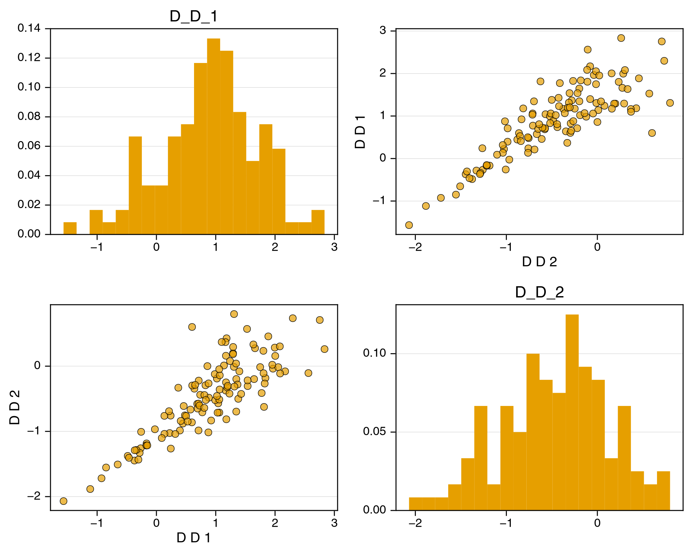
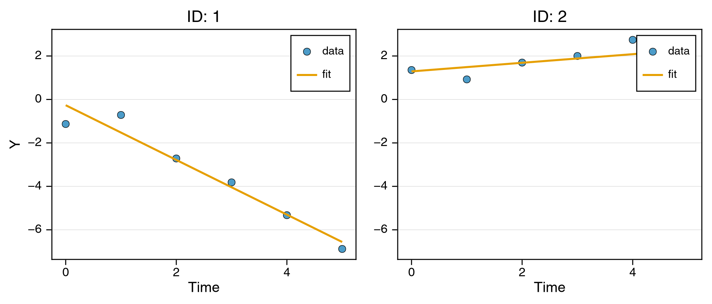
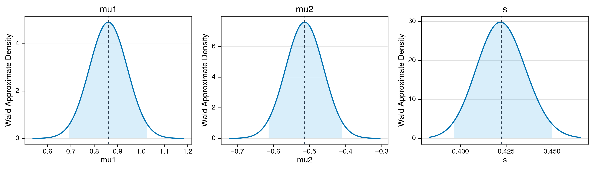

# Copula Random Effects (Laplace)

A multivariate random effect is almost always given an `MvNormal`, which fixes two things at once: the marginals are Gaussian *and* the dependence between them is Gaussian. A copula separates the two. [Copulas.jl](https://github.com/lrnv/Copulas.jl)'s `SklarDist(copula, marginals)` is an ordinary `Distributions.jl` multivariate distribution, so NoLimits accepts it wherever a random-effect distribution is accepted, and the dependence structure becomes a modelling choice of its own.

This tutorial takes the shortest honest route to trusting that machinery: declare a model at known parameter values, simulate from it, and fit the simulation back. The random effect is a subject-specific intercept and slope whose marginals are Normal but whose dependence is Clayton - strong in the lower tail, weak in the upper - a shape no correlation coefficient can produce.

## Learning Goals

- Declare a copula random effect and know why `Copulas.` must be spelled out inside `@randomEffects`.
- Simulate from a model at known truth with `simulate_data_model`.
- Recover the fixed effects with `Laplace` and read the empirical-Bayes estimates for the dependence you put in.
- Quantify uncertainty with Wald intervals and check they cover the truth.

## Step 1: Declare the Model at the Truth

`Copulas` is an optional dependency, so it must be installed and loaded alongside NoLimits:

```julia
using Pkg; Pkg.add("Copulas")
```

Each subject gets a two-element random effect `D`: an intercept with marginal `Normal(mu1, 0.9)` and a slope with marginal `Normal(mu2, 0.6)`, coupled by a Clayton copula with dependence parameter 3.0. The observation is linear in time given the subject's draw:

```math
y_{it} \sim \mathcal{N}\bigl(D_{i1} + D_{i2}\,t,\ s\bigr),
\qquad (D_{i1}, D_{i2}) \sim \mathrm{Sklar}\bigl(\mathrm{Clayton}(3.0), (\mathcal{N}(\mu_1, 0.9), \mathcal{N}(\mu_2, 0.6))\bigr).
```

```julia
using NoLimits
using CairoMakie
using Copulas
using DataFrames
using Distributions
using Random
using SciMLBase

Random.seed!(2026)

truth_model = @Model begin
    @fixedEffects begin
        mu1 = RealNumber(0.8, calculate_se=true)
        mu2 = RealNumber(-0.5, calculate_se=true)
        s = RealNumber(0.4, scale=:log, calculate_se=true)
    end

    @covariates begin
        t = Covariate()
    end

    @randomEffects begin
        D = RandomEffect(
            Copulas.SklarDist(Copulas.ClaytonCopula(2, 3.0),
                (Normal(mu1, 0.9), Normal(mu2, 0.6)));
            column=:ID)
    end

    @formulas begin
        y ~ Normal(D[1] + D[2] * t, s)
    end
end

NoLimits.summarize(truth_model)
```

!!! note "Qualify `Copulas` names inside `@randomEffects`"
    The random-effect distribution builder is compiled into a generated-function module that does not see the `using Copulas` in your script, so `Copulas.SklarDist` and `Copulas.ClaytonCopula` must be written out in full. A bare `SklarDist(...)` builds the model without complaint and then fails with `UndefVarError` when you construct the `DataModel`. `@formulas` resolves against your own scope and needs no such prefix.

<!- injected:t7-model ->
```text
ModelSummary
════════════════════════════════════════════════════════════════════════════════════════════════
Overview
  model type                          : non-ODE
  fixed-effect blocks                 : 3
  fixed-effect scalar values          : 3
  random effects                      : 1
  random-effect grouping columns      : 1
  covariates (declared)               : 1
  formulas (deterministic / outcomes) : 0 / 1
  requires DE accessors               : false

Structure blocks
  helpers              : false
  fixed effects        : true
  random effects       : true
  covariates           : true
  preDE                : false
  DifferentialEquation : false
  initialDE            : false

Covariate classes
  varying  : 1
  constant : 0
  dynamic  : 0

Fixed-effects declarations
  name  type        size  se  prior      scale     bounds                              details
  ---------------------------------------------------------------------------------------------------------
  mu1   RealNumber     1  yes  Priorless  identity  finite lower 0/1, finite upper 0/1  -
  mu2   RealNumber     1  yes  Priorless  identity  finite lower 0/1, finite upper 0/1  -
  s     RealNumber     1  yes  Priorless  log       finite lower 1/1, finite upper 0/1  -

Random-effects declarations
  name  group  dist     
  ------------------------
  D     ID     SklarDist

Covariate declarations
  name  kind       columns                   constant_on           interpolation
  ---------------------------------------------------------------------------------------
  t     Covariate  t                         -                     -

Formulas
  deterministic names : (none)
  outcome names       : y
  required DE states  : (none)
  required DE signals : (none)
  declared DE states  : (none)
  declared DE signals : (none)
Outcome distribution types
  y => Normal

Helper functions
  names : (none)
```

## Step 2: Simulate

`simulate_data_model` draws random effects and outcomes from the declared model and returns a new `DataModel` carrying them. The template frame supplies only the design - 120 subjects at six time points - and a placeholder `y` column that gets overwritten:

```julia
n_id, n_t = 120, 6
template = DataFrame(ID=repeat(1:n_id, inner=n_t),
                     t=repeat(collect(0.0:(n_t - 1)), n_id),
                     y=zeros(n_id * n_t))

dm_truth = DataModel(truth_model, template; primary_id=:ID, time_col=:t)
dm = simulate_data_model(dm_truth; rng=Random.Xoshiro(20))

first(get_df(dm), 8)
```

<!- injected:t7-df ->
```text
8×5 DataFrame
 Row │ ID     t        y          D_1        D_2
     │ Int64  Float64  Float64    Any        Any
─────┼────────────────────────────────────────────────
   1 │     1      0.0  -1.13003   -0.214162  -1.26234
   2 │     1      1.0  -0.714192  -0.214162  -1.26234
   3 │     1      2.0  -2.71662   -0.214162  -1.26234
   4 │     1      3.0  -3.8165    -0.214162  -1.26234
   5 │     1      4.0  -5.32669   -0.214162  -1.26234
   6 │     1      5.0  -6.88139   -0.214162  -1.26234
   7 │     2      0.0   1.35457   1.7395     0.133814
   8 │     2      1.0   0.923442  1.7395     0.133814
```

The drawn random effects are kept as `D_1` and `D_2` columns, one value per subject - the truth we are about to try to recover.

```julia
NoLimits.summarize(dm)
```

<!- injected:t7-dm ->
```text
DataModelSummary
════════════════════════════════════════════════════════════════════════════════════════════════
Overview
  model type                 : non-ODE
  event-aware                : false
  individuals                : 120
  rows (total / obs / event) : 720 / 720 / 0
  fixed effects (top-level)  : 3
  outcomes                   : 1
  covariates (declared)      : 1
  random effects             : 1

Covariate classes
  varying  : 1
  constant : 0
  dynamic  : 0

Outcome distribution types
  y => Normal

Random-effect distribution types
  D => SklarDist

Individual design diagnostics
  individuals with one observation              : 0
  global observed time range                    : 0.0000 to 5.0000
  unique observed time points                   : 6
  duplicate (ID, time) observation rows         : 0
  monotonic-time violations (observation order) : 0

Observations per individual
  metric       n          mean            sd           min           q25        median           q75           max
  ----------------------------------------------------------------------------------------------------------------
  count      120        6.0000        0.0000        6.0000        6.0000        6.0000        6.0000        6.0000

Time span per individual
  metric       n          mean            sd           min           q25        median           q75           max
  ----------------------------------------------------------------------------------------------------------------
  span       120        5.0000        0.0000        5.0000        5.0000        5.0000        5.0000        5.0000

Median sampling interval per individual
  metric          n          mean            sd           min           q25        median           q75           max
  -------------------------------------------------------------------------------------------------------------------
  median_dt     120        1.0000        0.0000        1.0000        1.0000        1.0000        1.0000        1.0000

Outcome descriptive statistics (observation rows)
  Variable       n          mean            sd           min           q25        median           q75           max
  ------------------------------------------------------------------------------------------------------------------
  y            720       -0.2679        2.5888      -11.8119       -1.5671        0.2172        1.4160        6.7817

Declared covariates
  name  kind       columns
  -------------------------------------
  t     Covariate  t

Covariate descriptive statistics (observation rows)
  Variable       n          mean            sd           min           q25        median           q75           max
  ------------------------------------------------------------------------------------------------------------------
  t.t          720        2.5000        1.7078        0.0000        1.0000        2.5000        4.0000        5.0000

Per-random-effect summary
  random effect  group  dist         levels  rows/level min        median           max
  -----------------------------------------------------------------------------------
  D              ID     SklarDist       120          6.0000        6.0000        6.0000
```

## Step 3: Fit with Laplace

The copula makes the marginal likelihood analytically intractable, so it has to be approximated. `Laplace` expands around each subject's empirical-Bayes mode and makes no distributional assumption beyond a twice-differentiable log-density, which is exactly what a `SklarDist` provides (see [Laplace](../estimation/laplace.md)). `GHQuadrature`, `MCMC`, `SAEM`, `MCEM` and `Pooled` work too; `FOCEI` is fine with a copula *random effect*, and rejects only a copula *outcome*.

```julia
serialization = SciMLBase.EnsembleThreads()

res = fit_model(
    dm,
    NoLimits.Laplace(; optim_kwargs=(maxiters=300,));
    serialization=serialization,
    rng=Random.Xoshiro(11),
)

NoLimits.summarize(res)
```

<!- injected:t7-res ->
```text
FitResultSummary
════════════════════════════════════════════════════════════════════════════════════════════════
Overview
  method                              : laplace
  inference                           : frequentist
  scale                               : natural
  objective                           : 779.3857
  iterations                          : 14
  parameters shown (reported / total) : 3 / 3

Parameter estimates
  parameter      Estimate
  -----------------------
  mu1              0.8603
  mu2             -0.5136
  s                0.4223

Outcome data coverage
  outcome       n_obs   n_missing
  -------------------------------
  y               720           0
  TOTAL           720           0

Empirical Bayes random effects summary (across RE levels)
  random effect  component       n          mean            sd           q25        median           q75
  --------------------------------------------------------------------------------------------------
  D              D_1           120        0.8929        0.8184        0.4373        1.0055        1.3519
  D              D_2           120       -0.4660        0.5864       -0.8426       -0.4235       -0.0713
```

The three fixed effects come back close to the values they were simulated at: `mu1` 0.860 against 0.8, `mu2` -0.514 against -0.5, and `s` 0.422 against 0.4.

## Step 4: The Dependence in the Empirical-Bayes Estimates

`get_random_effects` returns one column per dimension, `D_1` and `D_2`, and the pairplot shows their joint shape. The Clayton signature is visible: subjects low in both effects lie on a tight lower-left ridge, while high subjects scatter widely. A Gaussian random effect fitted to the same data would spread the two tails symmetrically.

```julia
p_pair = plot_random_effect_pairplot(res)

p_pair
```

<!- injected:t7-ppair ->


```julia
p_fit = plot_fits(res; observable=:y, individuals_idx=[1, 2], ncols=2)

p_fit
```

<!- injected:t7-pfit ->


## Step 5: Wald Uncertainty Quantification

```julia
uq = compute_uq(
    res;
    method=:wald,
    n_draws=800,
    level=0.95,
    rng=Random.Xoshiro(153),
)

NoLimits.summarize(res, uq)
```

<!- injected:t7-uq ->
```text
UQResultSummary
════════════════════════════════════════════════════════════════════════════════════════════════
Overview
  backend                             : wald
  source_method                       : laplace
  inference                           : frequentist
  scale                               : natural
  objective                           : 779.3857
  interval level                      : 0.9500
  parameters shown (reported / total) : 3 / 3

Parameter uncertainty summary
  parameter      Estimate    Std. Error      CI Lower      CI Upper
  ---------------------------------------------------
  mu1              0.8603        0.0841        0.6919        1.0266
  mu2             -0.5136        0.0547       -0.6132       -0.4096
  s                0.4223        0.0134        0.3964        0.4500

Outcome data coverage
  outcome       n_obs   n_missing
  -------------------------------
  y               720           0
  TOTAL           720           0

Empirical Bayes random effects summary (across RE levels)
  random effect  component       n          mean            sd           q25        median           q75
  --------------------------------------------------------------------------------------------------
  D              D_1           120        0.8929        0.8184        0.4373        1.0055        1.3519
  D              D_2           120       -0.4660        0.5864       -0.8426       -0.4235       -0.0713
```

Every 95% interval covers the simulation truth.

```julia
plot_uq_distributions(uq; scale=:natural, plot_type=:density, show_legend=false)
```

<!- injected:t7-puq ->


## Interpretation Notes

- **Marginals are estimated, dependence is declared.** `mu1` and `mu2` are the marginal locations and are estimated here; the Clayton parameter is held at 3.0. It can be estimated as well - declare it as a fixed effect on the log scale and pass it into `ClaytonCopula` - but dependence parameters are informed only through the joint shape of the random effects, so they need many subjects with informative per-subject data before they sharpen up.
- **What NoLimits reads out of a copula.** `GHQuadrature` transports its quadrature nodes through the marginal quantile functions and `MCMC` samples in a product-of-marginals base space, both through the `NoLimits._re_marginals` hook the `Copulas` extension provides. `Pooled` plugs the random effect in at its marginal means, which a copula never shifts, so `get_notes(res).plugin.D` reports `:mean`.
- **Recovery is a test, not a formality.** Simulating at known values and fitting back is the cheapest way to catch a mis-specified declaration; a `column` typo or an unqualified `SklarDist` shows up here rather than in a real analysis.
- **Reusable template.** Swap `ClaytonCopula` for any other copula, or the Normal marginals for skewed or bounded ones, and nothing else in the workflow changes. See [Copula Distributions](../model-building/copulas.md) for copulas as outcome distributions.

## Where to go next

- [Hidden & Observed Markov Models](markov-models-observed-hidden-coarsed.md) - the next tutorial.
- [All tutorials](index.md) - the full list, tagged by outcome, model, and estimator.
- [Troubleshooting](../troubleshooting.md) - when a fit fails or does not converge.
