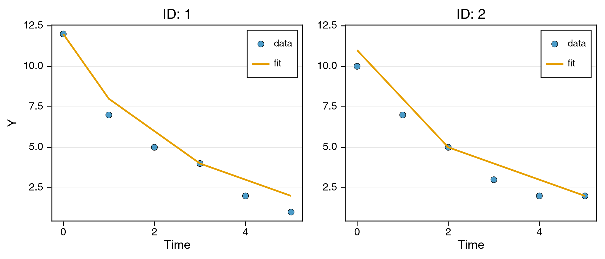
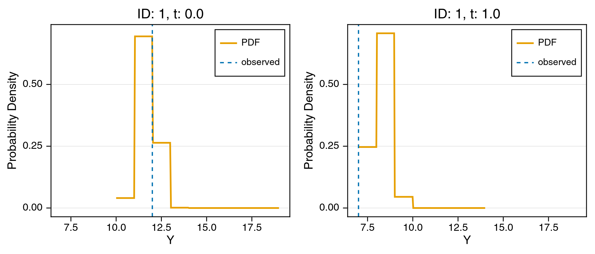
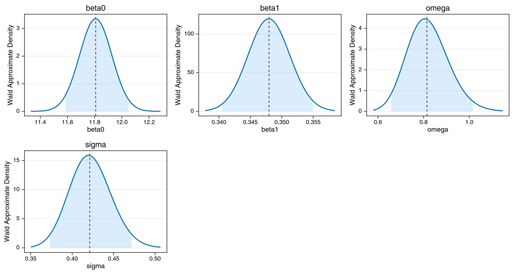

# Mixed-Effects Tutorial 8: Interval-Censored (Binned) Outcomes (Laplace)

Some measurements are never observed exactly. A lab that reports a count to the nearest whole unit, a questionnaire scored in bands, a delay recorded as "day 3" rather than "3.4 days" - in each case the record says only that the true value fell inside an interval. Treating the reported number as if it were exact adds the bin's own variance to the residual and inflates the estimated measurement noise. The fix is an *interval-censored likelihood*, where an observation contributes the probability mass of its interval, $F(u) - F(l)$, instead of a density at a point.

[CensoredDistributions.jl](https://github.com/EpiAware/CensoredDistributions.jl) supplies exactly that distribution, and NoLimits accepts it as an outcome without any glue code: the likelihood only ever calls the generic `Distributions.jl` interface. This tutorial simulates binned longitudinal data at known parameters, recovers them with `Laplace`, and shows what the naive Normal model gets wrong on the same data.

For censoring at a detection limit - values below an assay's LLOQ - use `censored(...)` from `Distributions.jl` instead; see the [left-censored viral load tutorial](mixed-effects-left-censored-virload50-laplace.md).

## Learning Goals

- Encode binned observations with `interval_censored(Normal(mu, sigma), width)`.
- Simulate from a model at known truth with `simulate_data_model` and fit the result back.
- Quantify what a naive Normal likelihood costs on the same binned data.
- Diagnose a fit whose outcome distribution defines no mean.

## Step 1: Define the Model and Simulate Binned Data

The mean is an exponential decay whose intercept carries a subject random effect, and the outcome is recorded only to the nearest whole unit:

```math
\mu_{it} = (\beta_0 + \eta_i)\,e^{-\beta_1 t},
\qquad y_{it} \sim \mathrm{IntervalCensored}\bigl(\mathcal{N}(\mu_{it}, \sigma), 1\bigr).
```

`interval_censored(d, 1.0)` bins the support of `d` into unit-width intervals, so an observation recorded as `7.0` contributes $P(7 \le Y < 8)$ under the underlying Normal. `simulate_data_model` draws random effects and outcomes from the declared model and returns a new `DataModel`, so the simulated `y` column already arrives binned.

```julia
using NoLimits
using CairoMakie
using CensoredDistributions
using DataFrames
using Distributions
using Random
using SciMLBase

Random.seed!(2026)

model = @Model begin
    @fixedEffects begin
        beta0 = RealNumber(12.0, calculate_se=true)
        beta1 = RealNumber(0.35, scale=:log, calculate_se=true)
        omega = RealNumber(0.8, scale=:log, calculate_se=true)
        sigma = RealNumber(0.4, scale=:log, calculate_se=true)
    end

    @covariates begin
        t = Covariate()
    end

    @randomEffects begin
        eta = RandomEffect(Normal(0.0, omega); column=:ID)
    end

    @formulas begin
        mu = (beta0 + eta) * exp(-beta1 * t)
        y ~ interval_censored(Normal(mu, sigma), 1.0)
    end
end

NoLimits.summarize(model)
```

<!- injected:t8-model ->
```text
ModelSummary
════════════════════════════════════════════════════════════════════════════════════════════════
Overview
  model type                          : non-ODE
  fixed-effect blocks                 : 4
  fixed-effect scalar values          : 4
  random effects                      : 1
  random-effect grouping columns      : 1
  covariates (declared)               : 1
  formulas (deterministic / outcomes) : 1 / 1
  requires DE accessors               : false

Structure blocks
  helpers              : false
  fixed effects        : true
  random effects       : true
  covariates           : true
  preDE                : false
  DifferentialEquation : false
  initialDE            : false

Covariate classes
  varying  : 1
  constant : 0
  dynamic  : 0

Fixed-effects declarations
  name   type        size  se  prior      scale     bounds                              details
  ----------------------------------------------------------------------------------------------------------
  beta0  RealNumber     1  yes  Priorless  identity  finite lower 0/1, finite upper 0/1  -
  beta1  RealNumber     1  yes  Priorless  log       finite lower 1/1, finite upper 0/1  -
  omega  RealNumber     1  yes  Priorless  log       finite lower 1/1, finite upper 0/1  -
  sigma  RealNumber     1  yes  Priorless  log       finite lower 1/1, finite upper 0/1  -

Random-effects declarations
  name  group  dist  
  ---------------------
  eta   ID     Normal

Covariate declarations
  name  kind       columns                   constant_on           interpolation
  ---------------------------------------------------------------------------------------
  t     Covariate  t                         -                     -

Formulas
  deterministic names : mu
  outcome names       : y
  required DE states  : (none)
  required DE signals : (none)
  declared DE states  : (none)
  declared DE signals : (none)
Outcome distribution types
  y => interval_censored

Helper functions
  names : (none)
```

The template frame carries the design - 60 subjects at six time points - and a placeholder `y` column that `simulate_data_model` overwrites:

```julia
n_id, n_t = 60, 6
template = DataFrame(ID=repeat(1:n_id, inner=n_t),
                     t=repeat(collect(0.0:(n_t - 1)), n_id),
                     y=zeros(n_id * n_t))

dm_truth = DataModel(model, template; primary_id=:ID, time_col=:t)
dm = simulate_data_model(dm_truth; rng=Random.Xoshiro(20))

first(get_df(dm), 8)
```

<!- injected:t8-df ->
```text
8×4 DataFrame
 Row │ ID     t        y        eta
     │ Int64  Float64  Float64  Any
─────┼────────────────────────────────────
   1 │     1      0.0     12.0  -0.498712
   2 │     1      1.0      7.0  -0.498712
   3 │     1      2.0      5.0  -0.498712
   4 │     1      3.0      4.0  -0.498712
   5 │     1      4.0      2.0  -0.498712
   6 │     1      5.0      1.0  -0.498712
   7 │     2      0.0     10.0  -1.2562
   8 │     2      1.0      7.0  -1.2562
```

The simulated frame keeps the drawn random effects in an `eta` column, and every `y` is a whole number - the bin the true value fell into.

```julia
NoLimits.summarize(dm)
```

<!- injected:t8-dm ->
```text
DataModelSummary
════════════════════════════════════════════════════════════════════════════════════════════════
Overview
  model type                 : non-ODE
  event-aware                : false
  individuals                : 60
  rows (total / obs / event) : 360 / 360 / 0
  fixed effects (top-level)  : 4
  outcomes                   : 1
  covariates (declared)      : 1
  random effects             : 1

Covariate classes
  varying  : 1
  constant : 0
  dynamic  : 0

Outcome distribution types
  y => interval_censored

Random-effect distribution types
  eta => Normal

Individual design diagnostics
  individuals with one observation              : 0
  global observed time range                    : 0.0000 to 5.0000
  unique observed time points                   : 6
  duplicate (ID, time) observation rows         : 0
  monotonic-time violations (observation order) : 0

Observations per individual
  metric       n          mean            sd           min           q25        median           q75           max
  ----------------------------------------------------------------------------------------------------------------
  count       60        6.0000        0.0000        6.0000        6.0000        6.0000        6.0000        6.0000

Time span per individual
  metric       n          mean            sd           min           q25        median           q75           max
  ----------------------------------------------------------------------------------------------------------------
  span        60        5.0000        0.0000        5.0000        5.0000        5.0000        5.0000        5.0000

Median sampling interval per individual
  metric          n          mean            sd           min           q25        median           q75           max
  -------------------------------------------------------------------------------------------------------------------
  median_dt      60        1.0000        0.0000        1.0000        1.0000        1.0000        1.0000        1.0000

Outcome descriptive statistics (observation rows)
  Variable       n          mean            sd           min           q25        median           q75           max
  ------------------------------------------------------------------------------------------------------------------
  y            360        5.3667        3.4196        0.0000        2.0000        4.0000        8.0000       13.0000

Declared covariates
  name  kind       columns
  -------------------------------------
  t     Covariate  t

Covariate descriptive statistics (observation rows)
  Variable       n          mean            sd           min           q25        median           q75           max
  ------------------------------------------------------------------------------------------------------------------
  t.t          360        2.5000        1.7078        0.0000        1.0000        2.5000        4.0000        5.0000

Per-random-effect summary
  random effect  group  dist      levels  rows/level min        median           max
  --------------------------------------------------------------------------------
  eta            ID     Normal        60          6.0000        6.0000        6.0000
```

## Step 2: Fit with Laplace

The random effect enters the mean linearly but the interval-censored likelihood is not Gaussian in it, so the marginal likelihood has no closed form. `Laplace` expands around each subject's empirical-Bayes mode (see [Laplace](../estimation/laplace.md)); `FOCEI` is not available here, because its Fisher-information surrogate is built from a fixed list of outcome families.

```julia
serialization = SciMLBase.EnsembleThreads()

res = fit_model(
    dm,
    NoLimits.Laplace(; optim_kwargs=(maxiters=300,));
    serialization=serialization,
    rng=Random.Xoshiro(11),
)

NoLimits.summarize(res)
```

<!- injected:t8-res ->
```text
FitResultSummary
════════════════════════════════════════════════════════════════════════════════════════════════
Overview
  method                              : laplace
  inference                           : frequentist
  scale                               : natural
  objective                           : 325.1568
  iterations                          : 15
  parameters shown (reported / total) : 4 / 4

Parameter estimates
  parameter      Estimate
  -----------------------
  beta0           11.8074
  beta1            0.3480
  omega            0.8146
  sigma            0.4212

Outcome data coverage
  outcome       n_obs   n_missing
  -------------------------------
  y               360           0
  TOTAL           360           0

Empirical Bayes random effects summary (across RE levels)
  random effect       n          mean            sd           q25        median           q75
  ---------------------------------------------------------------------------
  eta                60       -0.0003        0.7392       -0.4437        0.1058        0.4299
```

## Step 3: What the Naive Normal Model Costs

Fitting the same binned numbers as if they were exact measurements is the tempting shortcut. The only change is the outcome line:

```julia
naive_model = @Model begin
    @fixedEffects begin
        beta0 = RealNumber(12.0)
        beta1 = RealNumber(0.35, scale=:log)
        omega = RealNumber(0.8, scale=:log)
        sigma = RealNumber(0.4, scale=:log)
    end

    @covariates begin
        t = Covariate()
    end

    @randomEffects begin
        eta = RandomEffect(Normal(0.0, omega); column=:ID)
    end

    @formulas begin
        mu = (beta0 + eta) * exp(-beta1 * t)
        y ~ Normal(mu, sigma)
    end
end

dm_naive = DataModel(naive_model, get_df(dm); primary_id=:ID, time_col=:t)
res_naive = fit_model(
    dm_naive,
    NoLimits.Laplace(; optim_kwargs=(maxiters=300,));
    serialization=serialization,
    rng=Random.Xoshiro(11),
)

p_cens = NoLimits.get_params(res; scale=:untransformed)
p_naive = NoLimits.get_params(res_naive; scale=:untransformed)

DataFrame(parameter=["beta0", "beta1", "omega", "sigma"],
          truth=[12.0, 0.35, 0.8, 0.4],
          interval_censored=round.([p_cens.beta0, p_cens.beta1,
                                    p_cens.omega, p_cens.sigma]; digits=4),
          naive_normal=round.([p_naive.beta0, p_naive.beta1,
                               p_naive.omega, p_naive.sigma]; digits=4))
```

<!- injected:t8-comparison ->
```text
4×4 DataFrame
 Row │ parameter  truth    interval_censored  naive_normal
     │ String     Float64  Float64            Float64
─────┼─────────────────────────────────────────────────────
   1 │ beta0        12.0             11.8074       11.3639
   2 │ beta1         0.35             0.348         0.38
   3 │ omega         0.8              0.8146        0.8336
   4 │ sigma         0.4              0.4212        0.5226
```

The interval-censored fit recovers all four parameters. The naive fit absorbs the binning into the residual: rounding to unit width adds a variance of $w^2/12$, so its `sigma` lands near $\sqrt{0.4^2 + 1/12} \approx 0.493$ rather than at 0.4, and the distortion leaks into `beta0` and `beta1` as well. The wider the bins relative to the true noise, the larger the gap.

## Step 4: Diagnostics for a Distribution Without a Mean

`CensoredDistributions`' interval-censored distribution defines `logpdf`, `cdf` and `quantile`, but no `mean` or `var`. `plot_fits` draws its prediction line from `mean` by default and leaves a gap when that is undefined, so pass a statistic the distribution does supply:

```julia
p_fit = plot_fits(
    res;
    observable=:y,
    plot_func=median,
    individuals_idx=[1, 2],
    ncols=2,
)

p_fit
```

<!- injected:t8-pfit ->


The fitted line steps because the median of a binned distribution is itself a bin. The same limitation shows up in `get_residuals`, where `res_raw` and `res_pearson` are `missing` while `pit`, `res_quantile` and `logscore` - which need only `cdf` and `logpdf` - are computed as usual.

`plot_observation_distributions` needs neither, and shows the discrete predictive mass directly:

```julia
p_obs = plot_observation_distributions(
    res;
    observables=:y,
    individuals_idx=1,
    obs_rows=[1, 2],
)

p_obs
```

<!- injected:t8-pobs ->


## Step 5: Wald Uncertainty Quantification

```julia
uq = compute_uq(
    res;
    method=:wald,
    n_draws=800,
    level=0.95,
    rng=Random.Xoshiro(153),
)

NoLimits.summarize(res, uq)
```

<!- injected:t8-uq ->
```text
UQResultSummary
════════════════════════════════════════════════════════════════════════════════════════════════
Overview
  backend                             : wald
  source_method                       : laplace
  inference                           : frequentist
  scale                               : natural
  objective                           : 325.1568
  interval level                      : 0.9500
  parameters shown (reported / total) : 4 / 4

Parameter uncertainty summary
  parameter      Estimate    Std. Error      CI Lower      CI Upper
  ---------------------------------------------------
  beta0           11.8074        0.1198       11.5851       12.0462
  beta1            0.3480        0.0035        0.3405        0.3550
  omega            0.8146        0.0920        0.6575        1.0156
  sigma            0.4212        0.0251        0.3730        0.4720

Outcome data coverage
  outcome       n_obs   n_missing
  -------------------------------
  y               360           0
  TOTAL           360           0

Empirical Bayes random effects summary (across RE levels)
  random effect       n          mean            sd           q25        median           q75
  ---------------------------------------------------------------------------
  eta                60       -0.0003        0.7392       -0.4437        0.1058        0.4299
```

```julia
plot_uq_distributions(uq; scale=:natural, plot_type=:density, show_legend=false)
```

<!- injected:t8-puq ->


All four 95% intervals cover the simulation truth.

## Interpretation Notes

- **Binning is censoring.** Any measurement reported on a coarse grid is interval-censored, whether or not it is described that way. If the grid is coarse relative to the measurement noise, the naive likelihood inflates `sigma` by roughly $w^2/12$ in variance and drags the structural parameters with it.
- **No integration code is needed.** `interval_censored` is an ordinary `Distribution`; NoLimits calls `logpdf` on it like any other outcome. The same holds for any third-party distribution - see [`@formulas`](../model-building/formulas.md).
- **Method availability.** `MLE`, `MAP`, `MCMC`, `Laplace`, `GHQuadrature`, `SAEM`, `MCEM`, `Pooled` and `PooledMap` all work. `FOCEI` rejects the outcome by design, and `VI` can diverge on any likelihood that is `-Inf` over part of the parameter space.
- **Reusable template.** Swap the bin width for the grid your data are reported on, or move to a per-observation interval, and the rest of the workflow is unchanged.
